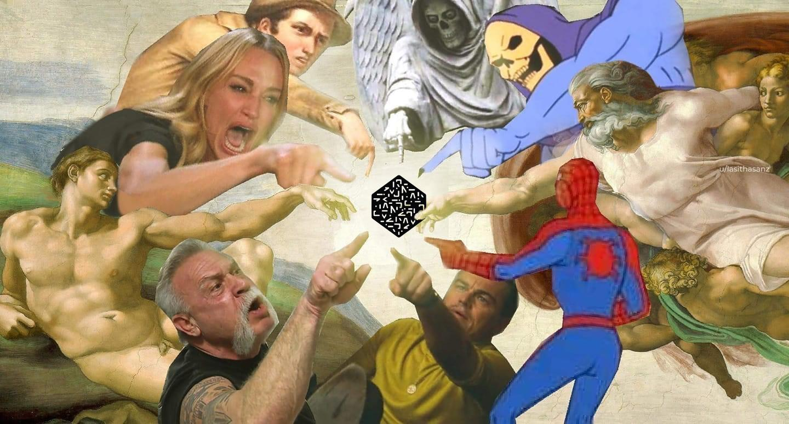
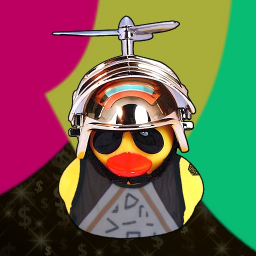

<br>
<center></center>
<br>


```{r setup, include=FALSE}
knitr::opts_chunk$set(echo = TRUE)
htmltools::tagList(rmarkdown::html_dependency_font_awesome())

# Preload All Libararies
library(Rnumerai)
pacman::p_load(data.table, dplyr, dtplyr, stringr, fst) # for data munging
pacman::p_load(crosstalk, htmltools) # for interactivitiy 
pacman::p_load(ggplot2, plotly, scales, ggpubr, ggthemes, ggdark, wesanderson) # for charts


# Load Data (see download_data.R)
d_round_corr <- as.data.table(read_fst("./data/round_corr_latest.fst"))


# Latest record per Round
d_round_corr[, last_date := max(Date), by = Round_Number]
d_latest <- copy(d_round_corr[Date == last_date])


# CORR + MMC (for New Leaderboard)
d_latest[, CorrMMC := Round_Correlation + MMC]


# Round Summary
d_smry <- d_latest %>% lazy_dt() %>% group_by(Round_Number) %>%
  summarise(min_cor = round(min(Round_Correlation),5),
            p25_cor = round(quantile(Round_Correlation, probs = 0.25),5),
            avg_cor = round(mean(Round_Correlation),5),
            p75_cor = round(quantile(Round_Correlation, probs = 0.75),5),
            max_cor = round(max(Round_Correlation),5),
            
            min_mmc = round(min(MMC, na.rm = TRUE),5),
            p25_mmc = round(quantile(MMC, probs = 0.25, na.rm = TRUE),5),
            avg_mmc = round(mean(MMC, na.rm = TRUE),5),
            p75_mmc = round(quantile(MMC, probs = 0.75, na.rm = TRUE),5),
            max_mmc = round(max(MMC, na.rm = TRUE),5),
            
            min_cm = round(min(CorrMMC, na.rm = TRUE),5),
            p25_cm = round(quantile(CorrMMC, probs = 0.25, na.rm = TRUE),5),
            avg_cm = round(mean(CorrMMC, na.rm = TRUE),5),
            p75_cm = round(quantile(CorrMMC, probs = 0.75, na.rm = TRUE),5),
            max_cm = round(max(CorrMMC, na.rm = TRUE),5)
                            ) %>% as.data.table()
d_smry[, Username := "round_summary"]


# Add NAs to missing rounds
ls_username <- unique(d_latest$Username)
d_new <- c() # main data table for graphs
for (item in ls_username) {
  
  tmp_d <- d_latest[Username == item]
  n_round <- nrow(tmp_d)
  n_round_ideal <- max(tmp_d$Round_Number) - min(tmp_d$Round_Number) + 1
  
  # Fill missing rounds if needed
  if (n_round < n_round_ideal) {
    
    tmp_all_round <- data.table(Round_Number = min(tmp_d$Round_Number):max(tmp_d$Round_Number))
    tmp_all_round <- merge(tmp_all_round, tmp_d, by = c("Round_Number"), all.x = TRUE, sort = TRUE)
    tmp_all_round[, Username := item]
    
  } else {
    tmp_all_round <- tmp_d
  }
  
  # Store
  d_new <- rbind(d_new, tmp_all_round)
  
}


# Corr Rank and Percentile
d_new[, corr_rank := rank(Round_Correlation) - 1, by = Round_Number]
d_new[, corr_rank_max := max(corr_rank), by = Round_Number]
d_new[, corr_pct := round(corr_rank / corr_rank_max * 100, 2)]
d_new[, corr_rank := NULL]
d_new[, corr_rank_max := NULL]

# MMC Rank and Percentile
d_new[, mmc_rank := rank(MMC) - 1, by = Round_Number]
d_new[, mmc_rank_max := max(mmc_rank), by = Round_Number]
d_new[, mmc_pct := round(mmc_rank / mmc_rank_max * 100, 2)]
d_new[, mmc_rank := NULL]
d_new[, mmc_rank_max := NULL]

# Corr+MMC Rank and Percentile
d_new[, corrmmc_rank := rank(CorrMMC) - 1, by = Round_Number]
d_new[, corrmmc_rank_max := max(corrmmc_rank), by = Round_Number]
d_new[, corrmmc_pct := round(corrmmc_rank / corrmmc_rank_max * 100, 2)]
d_new[, corrmmc_rank := NULL]
d_new[, corrmmc_rank_max := NULL]


# Prepare Shared Data for Crosstalk
d_new[, key := paste0(Username, "_", Round_Number)]
d_new[, Round_Correlation := round(Round_Correlation, 5)]
d_new[, MMC := round(MMC, 5)]
d_new[, CorrMMC := round(CorrMMC, 5)]
sd <- SharedData$new(d_new, key = ~key)


# ==============================================================================
# Generate Plot for Specific Models
# ==============================================================================

# Define model names here
models_all <- c("ia_ai", "the_razor", "woobe", "the_sweetspot", "the_half_and_half",
               "the_divergent", "the_unexposed", "the_parachute", "low_cor_pred", "the_unburnt",
               paste0("the_aijoe", 1:5))

# My Models (CORR)
g_all_cor <-
  ggplot(d_new[Username %in% models_all]) +
  dark_mode(theme_fivethirtyeight()) +
  # scale_color_brewer(type='qual', palette	='Paired') + 
  scale_color_tableau("Tableau 20") +
  theme(plot.background = element_rect(fill = "#222222")) + # or #222 in darkly
  theme(panel.background = element_rect(fill = "#222222")) +
  theme(legend.background = element_rect(fill = "#222222")) +
  geom_ribbon(data = d_smry, aes(x = Round_Number, ymax = max_cor, ymin = min_cor, group = Username), fill = "white", alpha = 0.025) +
  geom_ribbon(data = d_smry, aes(x = Round_Number, ymax = p75_cor, ymin = p25_cor, group = Username), fill = "white", alpha = 0.05) +
  theme(plot.title = element_text(size = 12),
       axis.text = element_text(size = 6),
       axis.title = element_text(size = 10),
       legend.title = element_text(size = 8),
       legend.text = element_text(size = 6)) +
  theme(axis.title.x = element_blank()) +
  xlab("Round") + ylab("Correlation") + 
  scale_y_continuous(breaks = pretty_breaks(n = 10)) +
  scale_x_continuous(breaks = pretty_breaks(n = 10)) +
  geom_point(aes(x = Round_Number, y = Round_Correlation, group = Username, colour = Username), size = 0.5) +
  geom_path(aes(x = Round_Number, y = Round_Correlation, group = Username, colour = Username), size = 0.3) +
  geom_path(data = d_new[Username == "integration_test"], 
            aes(x = Round_Number, y = Round_Correlation, group = Username, colour = "Baseline (integration_test)"), 
            linetype = "dotted", size = 0.25, alpha = 0.5)

# My Models (MMC)
# g_all_mmc <-
#   ggplot(d_new[Username %in% models_all]) +
#   dark_mode(theme_fivethirtyeight()) +
#   # scale_color_brewer(type='qual', palette	='Paired') + 
#   scale_color_tableau("Tableau 20") +
#   theme(plot.background = element_rect(fill = "#222222")) + # or #222 in darkly
#   theme(panel.background = element_rect(fill = "#222222")) +
#   theme(legend.background = element_rect(fill = "#222222")) +
#   geom_ribbon(data = d_smry, aes(x = Round_Number, ymax = max_mmc, ymin = min_mmc, group = Username), fill = "white", alpha = 0.025) +
#   geom_ribbon(data = d_smry, aes(x = Round_Number, ymax = p75_mmc, ymin = p25_mmc, group = Username), fill = "white", alpha = 0.05) +
#   theme(plot.title = element_text(size = 12),
#        axis.text = element_text(size = 6),
#        axis.title = element_text(size = 10),
#        legend.title = element_text(size = 8),
#        legend.text = element_text(size = 6)) +
#   theme(axis.title.x = element_blank()) +
#   xlab("Round") + ylab("MMC") + 
#   scale_y_continuous(breaks = pretty_breaks(n = 10)) +
#   scale_x_continuous(breaks = pretty_breaks(n = 10)) +
#   geom_point(aes(x = Round_Number, y = MMC, group = Username, colour = Username), size = 0.5) +
#   geom_path(aes(x = Round_Number, y = MMC, group = Username, colour = Username), size = 0.3) +
#   geom_path(data = d_new[Username == "integration_test"], 
#             aes(x = Round_Number, y = MMC, group = Username, colour = "Baseline (integration_test)"), 
#             linetype = "dotted", size = 0.25, alpha = 0.5)


# My Models (CORR + MMC)
g_all_cm <-
  ggplot(d_new[Username %in% models_all]) +
  dark_mode(theme_fivethirtyeight()) +
  # scale_color_brewer(type='qual', palette	='Paired') + 
  scale_color_tableau("Tableau 20") +
  theme(plot.background = element_rect(fill = "#222222")) + # or #222 in darkly
  theme(panel.background = element_rect(fill = "#222222")) +
  theme(legend.background = element_rect(fill = "#222222")) +
  geom_ribbon(data = d_smry, aes(x = Round_Number, ymax = max_cm, ymin = min_cm, group = Username), fill = "white", alpha = 0.025) +
  geom_ribbon(data = d_smry, aes(x = Round_Number, ymax = p75_cm, ymin = p25_cm, group = Username), fill = "white", alpha = 0.05) +
  theme(plot.title = element_text(size = 12),
       axis.text = element_text(size = 6),
       axis.title = element_text(size = 10),
       legend.title = element_text(size = 8),
       legend.text = element_text(size = 6)) +
  theme(axis.title.x = element_blank()) +
  xlab("Round") + ylab("CORR + MMC") + 
  scale_y_continuous(breaks = pretty_breaks(n = 10)) +
  scale_x_continuous(breaks = pretty_breaks(n = 10)) +
  geom_point(aes(x = Round_Number, y = CorrMMC, group = Username, colour = Username), size = 0.5) +
  geom_path(aes(x = Round_Number, y = CorrMMC, group = Username, colour = Username), size = 0.3) +
  geom_path(data = d_new[Username == "integration_test"], 
            aes(x = Round_Number, y = CorrMMC, group = Username, colour = "Baseline (integration_test)"), 
            linetype = "dotted", size = 0.25, alpha = 0.5)


# New Models
models_new_g1 <- c("ia_ai", paste0("i_like_the_coin_", stringr::str_pad(1:15, 2, pad = "0")))
models_new_g2 <- c("ia_ai", paste0("u_pump_i_pump_", stringr::str_pad(1:5, 2, pad = "0")))
models_new_g3 <- c("ia_ai", paste0("the_hodler_", stringr::str_pad(1:5, 2, pad = "0")))
models_new_g4 <- c(#"ia_ai", "the_aijoe4",
                   "i_like_the_coin_06",
                   "the_hodler_01",
                   paste0("u_pump_i_pump_", stringr::str_pad(3:5, 2, pad = "0")))

# CORR (Group 1)
g_new_g1_cor <-
  ggplot(d_new[Username %in% models_new_g1]) +
  dark_mode(theme_fivethirtyeight()) +
  # scale_color_brewer(type='qual', palette	='Paired') + 
  scale_color_tableau("Tableau 20") +
  theme(plot.background = element_rect(fill = "#222222")) + # or #222 in darkly
  theme(panel.background = element_rect(fill = "#222222")) +
  theme(legend.background = element_rect(fill = "#222222")) +
  geom_ribbon(data = d_smry, aes(x = Round_Number, ymax = max_cor, ymin = min_cor, group = Username), fill = "white", alpha = 0.025) +
  geom_ribbon(data = d_smry, aes(x = Round_Number, ymax = p75_cor, ymin = p25_cor, group = Username), fill = "white", alpha = 0.05) +
  theme(plot.title = element_text(size = 12),
       axis.text = element_text(size = 6),
       axis.title = element_text(size = 10),
       legend.title = element_text(size = 8),
       legend.text = element_text(size = 6)) +
  theme(axis.title.x = element_blank()) +
  xlab("Round") + ylab("Correlation") + 
  scale_y_continuous(breaks = pretty_breaks(n = 10)) +
  scale_x_continuous(breaks = pretty_breaks(n = 10)) +
  geom_point(aes(x = Round_Number, y = Round_Correlation, group = Username, colour = Username), size = 0.5) +
  geom_path(aes(x = Round_Number, y = Round_Correlation, group = Username, colour = Username), size = 0.3) +
  geom_path(data = d_new[Username == "integration_test"], 
            aes(x = Round_Number, y = Round_Correlation, group = Username, colour = "Baseline (integration_test)"), 
            linetype = "dotted", size = 0.25, alpha = 0.5)

# CORR (Group 2)
g_new_g2_cor <-
  ggplot(d_new[Username %in% models_new_g2]) +
  dark_mode(theme_fivethirtyeight()) +
  # scale_color_brewer(type='qual', palette	='Paired') + 
  scale_color_tableau("Tableau 20") +
  theme(plot.background = element_rect(fill = "#222222")) + # or #222 in darkly
  theme(panel.background = element_rect(fill = "#222222")) +
  theme(legend.background = element_rect(fill = "#222222")) +
  geom_ribbon(data = d_smry, aes(x = Round_Number, ymax = max_cor, ymin = min_cor, group = Username), fill = "white", alpha = 0.025) +
  geom_ribbon(data = d_smry, aes(x = Round_Number, ymax = p75_cor, ymin = p25_cor, group = Username), fill = "white", alpha = 0.05) +
  theme(plot.title = element_text(size = 12),
       axis.text = element_text(size = 6),
       axis.title = element_text(size = 10),
       legend.title = element_text(size = 8),
       legend.text = element_text(size = 6)) +
  theme(axis.title.x = element_blank()) +
  xlab("Round") + ylab("Correlation") + 
  scale_y_continuous(breaks = pretty_breaks(n = 10)) +
  scale_x_continuous(breaks = pretty_breaks(n = 10)) +
  geom_point(aes(x = Round_Number, y = Round_Correlation, group = Username, colour = Username), size = 0.5) +
  geom_path(aes(x = Round_Number, y = Round_Correlation, group = Username, colour = Username), size = 0.3) +
  geom_path(data = d_new[Username == "integration_test"], 
            aes(x = Round_Number, y = Round_Correlation, group = Username, colour = "Baseline (integration_test)"), 
            linetype = "dotted", size = 0.25, alpha = 0.5)

# CORR (Group 3)
g_new_g3_cor <-
  ggplot(d_new[Username %in% models_new_g3]) +
  dark_mode(theme_fivethirtyeight()) +
  # scale_color_brewer(type='qual', palette	='Paired') + 
  scale_color_tableau("Tableau 20") +
  theme(plot.background = element_rect(fill = "#222222")) + # or #222 in darkly
  theme(panel.background = element_rect(fill = "#222222")) +
  theme(legend.background = element_rect(fill = "#222222")) +
  geom_ribbon(data = d_smry, aes(x = Round_Number, ymax = max_cor, ymin = min_cor, group = Username), fill = "white", alpha = 0.025) +
  geom_ribbon(data = d_smry, aes(x = Round_Number, ymax = p75_cor, ymin = p25_cor, group = Username), fill = "white", alpha = 0.05) +
  theme(plot.title = element_text(size = 12),
       axis.text = element_text(size = 6),
       axis.title = element_text(size = 10),
       legend.title = element_text(size = 8),
       legend.text = element_text(size = 6)) +
  theme(axis.title.x = element_blank()) +
  xlab("Round") + ylab("Correlation") + 
  scale_y_continuous(breaks = pretty_breaks(n = 10)) +
  scale_x_continuous(breaks = pretty_breaks(n = 10)) +
  geom_point(aes(x = Round_Number, y = Round_Correlation, group = Username, colour = Username), size = 0.5) +
  geom_path(aes(x = Round_Number, y = Round_Correlation, group = Username, colour = Username), size = 0.3) +
  geom_path(data = d_new[Username == "integration_test"], 
            aes(x = Round_Number, y = Round_Correlation, group = Username, colour = "Baseline (integration_test)"), 
            linetype = "dotted", size = 0.25, alpha = 0.5)

# CORR (Group 4)
g_new_g4_cor <-
  ggplot(d_new[Username %in% models_new_g4]) +
  dark_mode(theme_fivethirtyeight()) +
  # scale_color_brewer(type='qual', palette	='Paired') + 
  scale_color_tableau("Tableau 20") +
  theme(plot.background = element_rect(fill = "#222222")) + # or #222 in darkly
  theme(panel.background = element_rect(fill = "#222222")) +
  theme(legend.background = element_rect(fill = "#222222")) +
  geom_ribbon(data = d_smry, aes(x = Round_Number, ymax = max_cor, ymin = min_cor, group = Username), fill = "white", alpha = 0.025) +
  geom_ribbon(data = d_smry, aes(x = Round_Number, ymax = p75_cor, ymin = p25_cor, group = Username), fill = "white", alpha = 0.05) +
  theme(plot.title = element_text(size = 12),
       axis.text = element_text(size = 6),
       axis.title = element_text(size = 10),
       legend.title = element_text(size = 8),
       legend.text = element_text(size = 6)) +
  theme(axis.title.x = element_blank()) +
  xlab("Round") + ylab("Correlation") + 
  scale_y_continuous(breaks = pretty_breaks(n = 10)) +
  scale_x_continuous(breaks = pretty_breaks(n = 10)) +
  geom_point(aes(x = Round_Number, y = Round_Correlation, group = Username, colour = Username), size = 0.5) +
  geom_path(aes(x = Round_Number, y = Round_Correlation, group = Username, colour = Username), size = 0.3) +
  geom_path(data = d_new[Username == "integration_test"], 
            aes(x = Round_Number, y = Round_Correlation, group = Username, colour = "Baseline (integration_test)"), 
            linetype = "dotted", size = 0.25, alpha = 0.5)


# CORR + MMC (Group 1)
g_new_g1_cm <-
  ggplot(d_new[Username %in% models_new_g1]) +
  dark_mode(theme_fivethirtyeight()) +
  # scale_color_brewer(type='qual', palette	='Paired') + 
  scale_color_tableau("Tableau 20") +
  theme(plot.background = element_rect(fill = "#222222")) + # or #222 in darkly
  theme(panel.background = element_rect(fill = "#222222")) +
  theme(legend.background = element_rect(fill = "#222222")) +
  geom_ribbon(data = d_smry, aes(x = Round_Number, ymax = max_cm, ymin = min_cm, group = Username), fill = "white", alpha = 0.025) +
  geom_ribbon(data = d_smry, aes(x = Round_Number, ymax = p75_cm, ymin = p25_cm, group = Username), fill = "white", alpha = 0.05) +
  theme(plot.title = element_text(size = 12),
       axis.text = element_text(size = 6),
       axis.title = element_text(size = 10),
       legend.title = element_text(size = 8),
       legend.text = element_text(size = 6)) +
  theme(axis.title.x = element_blank()) +
  xlab("Round") + ylab("CORR + MMC") + 
  scale_y_continuous(breaks = pretty_breaks(n = 10)) +
  scale_x_continuous(breaks = pretty_breaks(n = 10)) +
  geom_point(aes(x = Round_Number, y = CorrMMC, group = Username, colour = Username), size = 0.5) +
  geom_path(aes(x = Round_Number, y = CorrMMC, group = Username, colour = Username), size = 0.3) +
  geom_path(data = d_new[Username == "integration_test"], 
            aes(x = Round_Number, y = CorrMMC, group = Username, colour = "Baseline (integration_test)"), 
            linetype = "dotted", size = 0.25, alpha = 0.5)

# CORR + MMC (Group 2)
g_new_g2_cm <-
  ggplot(d_new[Username %in% models_new_g2]) +
  dark_mode(theme_fivethirtyeight()) +
  # scale_color_brewer(type='qual', palette	='Paired') + 
  scale_color_tableau("Tableau 20") +
  theme(plot.background = element_rect(fill = "#222222")) + # or #222 in darkly
  theme(panel.background = element_rect(fill = "#222222")) +
  theme(legend.background = element_rect(fill = "#222222")) +
  geom_ribbon(data = d_smry, aes(x = Round_Number, ymax = max_cm, ymin = min_cm, group = Username), fill = "white", alpha = 0.025) +
  geom_ribbon(data = d_smry, aes(x = Round_Number, ymax = p75_cm, ymin = p25_cm, group = Username), fill = "white", alpha = 0.05) +
  theme(plot.title = element_text(size = 12),
       axis.text = element_text(size = 6),
       axis.title = element_text(size = 10),
       legend.title = element_text(size = 8),
       legend.text = element_text(size = 6)) +
  theme(axis.title.x = element_blank()) +
  xlab("Round") + ylab("CORR + MMC") + 
  scale_y_continuous(breaks = pretty_breaks(n = 10)) +
  scale_x_continuous(breaks = pretty_breaks(n = 10)) +
  geom_point(aes(x = Round_Number, y = CorrMMC, group = Username, colour = Username), size = 0.5) +
  geom_path(aes(x = Round_Number, y = CorrMMC, group = Username, colour = Username), size = 0.3) +
  geom_path(data = d_new[Username == "integration_test"], 
            aes(x = Round_Number, y = CorrMMC, group = Username, colour = "Baseline (integration_test)"), 
            linetype = "dotted", size = 0.25, alpha = 0.5)

# CORR + MMC (Group 3)
g_new_g3_cm <-
  ggplot(d_new[Username %in% models_new_g3]) +
  dark_mode(theme_fivethirtyeight()) +
  # scale_color_brewer(type='qual', palette	='Paired') + 
  scale_color_tableau("Tableau 20") +
  theme(plot.background = element_rect(fill = "#222222")) + # or #222 in darkly
  theme(panel.background = element_rect(fill = "#222222")) +
  theme(legend.background = element_rect(fill = "#222222")) +
  geom_ribbon(data = d_smry, aes(x = Round_Number, ymax = max_cm, ymin = min_cm, group = Username), fill = "white", alpha = 0.025) +
  geom_ribbon(data = d_smry, aes(x = Round_Number, ymax = p75_cm, ymin = p25_cm, group = Username), fill = "white", alpha = 0.05) +
  theme(plot.title = element_text(size = 12),
       axis.text = element_text(size = 6),
       axis.title = element_text(size = 10),
       legend.title = element_text(size = 8),
       legend.text = element_text(size = 6)) +
  theme(axis.title.x = element_blank()) +
  xlab("Round") + ylab("CORR + MMC") + 
  scale_y_continuous(breaks = pretty_breaks(n = 10)) +
  scale_x_continuous(breaks = pretty_breaks(n = 10)) +
  geom_point(aes(x = Round_Number, y = CorrMMC, group = Username, colour = Username), size = 0.5) +
  geom_path(aes(x = Round_Number, y = CorrMMC, group = Username, colour = Username), size = 0.3) +
  geom_path(data = d_new[Username == "integration_test"], 
            aes(x = Round_Number, y = CorrMMC, group = Username, colour = "Baseline (integration_test)"), 
            linetype = "dotted", size = 0.25, alpha = 0.5)

# CORR + MMC (Group 4)
g_new_g4_cm <-
  ggplot(d_new[Username %in% models_new_g4]) +
  dark_mode(theme_fivethirtyeight()) +
  # scale_color_brewer(type='qual', palette	='Paired') + 
  scale_color_tableau("Tableau 20") +
  theme(plot.background = element_rect(fill = "#222222")) + # or #222 in darkly
  theme(panel.background = element_rect(fill = "#222222")) +
  theme(legend.background = element_rect(fill = "#222222")) +
  geom_ribbon(data = d_smry, aes(x = Round_Number, ymax = max_cm, ymin = min_cm, group = Username), fill = "white", alpha = 0.025) +
  geom_ribbon(data = d_smry, aes(x = Round_Number, ymax = p75_cm, ymin = p25_cm, group = Username), fill = "white", alpha = 0.05) +
  theme(plot.title = element_text(size = 12),
       axis.text = element_text(size = 6),
       axis.title = element_text(size = 10),
       legend.title = element_text(size = 8),
       legend.text = element_text(size = 6)) +
  theme(axis.title.x = element_blank()) +
  xlab("Round") + ylab("CORR + MMC") + 
  scale_y_continuous(breaks = pretty_breaks(n = 10)) +
  scale_x_continuous(breaks = pretty_breaks(n = 10)) +
  geom_point(aes(x = Round_Number, y = CorrMMC, group = Username, colour = Username), size = 0.5) +
  geom_path(aes(x = Round_Number, y = CorrMMC, group = Username, colour = Username), size = 0.3) +
  geom_path(data = d_new[Username == "integration_test"], 
            aes(x = Round_Number, y = CorrMMC, group = Username, colour = "Baseline (integration_test)"), 
            linetype = "dotted", size = 0.25, alpha = 0.5)


# PCT (Group 4)
g_new_g4_pct_cm <-
  ggplot(d_new[Username %in% models_new_g4]) +
  dark_mode(theme_fivethirtyeight()) +
  # scale_color_brewer(type='qual', palette	='Paired') + 
  scale_color_tableau("Tableau 20") +
  theme(plot.background = element_rect(fill = "#222222")) + # or #222 in darkly
  theme(panel.background = element_rect(fill = "#222222")) +
  theme(legend.background = element_rect(fill = "#222222")) +
  # geom_ribbon(data = d_smry, aes(x = Round_Number, ymax = max_cm, ymin = min_cm, group = Username), fill = "white", alpha = 0.025) +
  # geom_ribbon(data = d_smry, aes(x = Round_Number, ymax = p75_cm, ymin = p25_cm, group = Username), fill = "white", alpha = 0.05) +
  theme(plot.title = element_text(size = 12),
       axis.text = element_text(size = 6),
       axis.title = element_text(size = 10),
       legend.title = element_text(size = 8),
       legend.text = element_text(size = 6)) +
  theme(axis.title.x = element_blank()) +
  xlab("Round") + ylab("CORR + MMC") + 
  scale_y_continuous(breaks = pretty_breaks(n = 10)) +
  scale_x_continuous(breaks = pretty_breaks(n = 10)) +
  geom_point(aes(x = Round_Number, y = corrmmc_pct, group = Username, colour = Username), size = 0.5) +
  geom_path(aes(x = Round_Number, y = corrmmc_pct, group = Username, colour = Username), size = 0.3) +
  geom_path(data = d_new[Username == "integration_test"], 
            aes(x = Round_Number, y = corrmmc_pct, group = Username, colour = "Baseline (integration_test)"), 
            linetype = "dotted", size = 0.25, alpha = 0.5)


```


#  {.tabset}


## Legacy (COR)

<br>
<center>
<h4>
Resolved / Latest Round Correlation
<br>
(Shaded Area = Min / 25th P / 75th P / Max)
<br>
(Highlight Area to Zoom In / Double-Click to Zoom Out)
</h4>

```{r, echo=FALSE, out.width="95%", warning=FALSE, message=FALSE}
ggplotly(g_all_cor) %>% config(displayModeBar = FALSE)
```

</center>


## Legacy (C+M)

<br>
<center>
<h4>
Resolved / Latest Round CORR + MMC
<br>
(Shaded Area = Min / 25th P / 75th P / Max)
<br>
(Highlight Area to Zoom In / Double-Click to Zoom Out)
</h4>

```{r, echo=FALSE, out.width="95%", warning=FALSE, message=FALSE}
ggplotly(g_all_cm) %>% config(displayModeBar = FALSE)
```

</center>


## New G1 (COR)

<br>
<center>
<h4>
Resolved / Latest Round CORR + MMC
<br>
(Shaded Area = Min / 25th P / 75th P / Max)
<br>
(Highlight Area to Zoom In / Double-Click to Zoom Out)
</h4>

```{r, echo=FALSE, out.width="95%", warning=FALSE, message=FALSE}
ggplotly(g_new_g1_cor) %>% config(displayModeBar = FALSE)
```

</center>


## New G1 (C+M)

<br>
<center>
<h4>
Resolved / Latest Round CORR + MMC
<br>
(Shaded Area = Min / 25th P / 75th P / Max)
<br>
(Highlight Area to Zoom In / Double-Click to Zoom Out)
</h4>

```{r, echo=FALSE, out.width="95%", warning=FALSE, message=FALSE}
ggplotly(g_new_g1_cm) %>% config(displayModeBar = FALSE)
```

</center>


## New G2 (COR)

<br>
<center>
<h4>
Resolved / Latest Round CORR + MMC
<br>
(Shaded Area = Min / 25th P / 75th P / Max)
<br>
(Highlight Area to Zoom In / Double-Click to Zoom Out)
</h4>

```{r, echo=FALSE, out.width="95%", warning=FALSE, message=FALSE}
ggplotly(g_new_g2_cor) %>% config(displayModeBar = FALSE)
```

</center>


## New G2 (C+M)

<br>
<center>
<h4>
Resolved / Latest Round CORR + MMC
<br>
(Shaded Area = Min / 25th P / 75th P / Max)
<br>
(Highlight Area to Zoom In / Double-Click to Zoom Out)
</h4>

```{r, echo=FALSE, out.width="95%", warning=FALSE, message=FALSE}
ggplotly(g_new_g2_cm) %>% config(displayModeBar = FALSE)
```

</center>


## New G3 (COR)

<br>
<center>
<h4>
Resolved / Latest Round CORR + MMC
<br>
(Shaded Area = Min / 25th P / 75th P / Max)
<br>
(Highlight Area to Zoom In / Double-Click to Zoom Out)
</h4>

```{r, echo=FALSE, out.width="95%", warning=FALSE, message=FALSE}
ggplotly(g_new_g3_cor) %>% config(displayModeBar = FALSE)
```

</center>

## New G3 (C+M)

<br>
<center>
<h4>
Resolved / Latest Round CORR + MMC
<br>
(Shaded Area = Min / 25th P / 75th P / Max)
<br>
(Highlight Area to Zoom In / Double-Click to Zoom Out)
</h4>

```{r, echo=FALSE, out.width="95%", warning=FALSE, message=FALSE}
ggplotly(g_new_g3_cm) %>% config(displayModeBar = FALSE)
```


</center>


## New G4 (COR)

<br>
<center>
<h4>
Resolved / Latest Round CORR + MMC
<br>
(Shaded Area = Min / 25th P / 75th P / Max)
<br>
(Highlight Area to Zoom In / Double-Click to Zoom Out)
</h4>

```{r, echo=FALSE, out.width="95%", warning=FALSE, message=FALSE}
ggplotly(g_new_g4_cor) %>% config(displayModeBar = FALSE)
```

</center>


## New G4 (C+M)

<br>
<center>
<h4>
Resolved / Latest Round CORR + MMC
<br>
(Shaded Area = Min / 25th P / 75th P / Max)
<br>
(Highlight Area to Zoom In / Double-Click to Zoom Out)
</h4>

```{r, echo=FALSE, out.width="95%", warning=FALSE, message=FALSE}
ggplotly(g_new_g4_cm) %>% config(displayModeBar = FALSE)
```

</center>


## New G4 (C+M PCT)

<br>
<center>
<h4>
Resolved / Latest Round CORR + MMC Percentile
<br>
(Highlight Area to Zoom In / Double-Click to Zoom Out)
</h4>

```{r, echo=FALSE, out.width="95%", warning=FALSE, message=FALSE}
ggplotly(g_new_g4_pct_cm) %>% config(displayModeBar = FALSE)
```

</center>


## Compare Your Models

<br>

<center>

<a href="https://medium.com/numerai/a-new-data-science-competition-where-being-different-pays-251c2aecc40a" target="_blank"></a><br>

<h3>

Check out this <a href="https://dashboard.numeraipayouts.com/" target="_blank">**Dashboard**</a> by Bouwe Ceunen!

</h3>

</center>


## Data

<br>
<center>
<a href="https://woobe.github.io/numerati/data.html" target="_blank"></a>
<br>
<h3>
<a href="https://raw.githubusercontent.com/woobe/numerati/master/data.csv" target="_blank">**Download Latest Data (CSV)**</a>
</h3>
<h3>
<a href="https://woobe.github.io/numerati/data.html" target="_blank">**Data Dashboard**</a>
</h3>
<center>


## About

<center>
<br>
This dashboard is brought to you by **<a href="https://twitter.com/matlabulous" target="_blank">Jo-fai (Joe) Chow</a>**  

**The IA_AI Crew**

<a href="https://numer.ai/ia_ai" target="_blank"></a><br>

*"The NMR Life Chose Me."*

<br>

<h5>
**Like What You See?**
</h5>

Support my community effort with $NMR (or other ERC-20 Tokens)


<h6>
My ETH Wallet Address:

`0x2a943dF83FE7D2e6Db651f937D848460159856e7`
</h6>

<br>

<h5>
**Disclaimer**
</h5>

<h6>
No NMR was burned in the making of this prototype.<br>
This is not an official <a href="https://numer.ai/" target="_blank">Numerai</a> product.<br><br>
Last updated: `r Sys.time()` UTC<br>
Prototype version: <a href="https://github.com/woobe/numerati#change-log" target="_blank">0.12</a><br>
Code: <a href="https://github.com/woobe/numerati" target="_blank">github.com/woobe/numerati</a>
</h6>

<a href="https://github.com/woobe" target="_blank"><i class="fa fa-github-square" aria-hidden="true"></i></a>   <a href="https://twitter.com/matlabulous" target="_blank"><i class="fa fa-twitter-square" aria-hidden="true"></i></a>   <a href="https://www.linkedin.com/in/jofaichow/" target="_blank"><i class="fa fa-linkedin-square" aria-hidden="true"></i></a>

</center>

